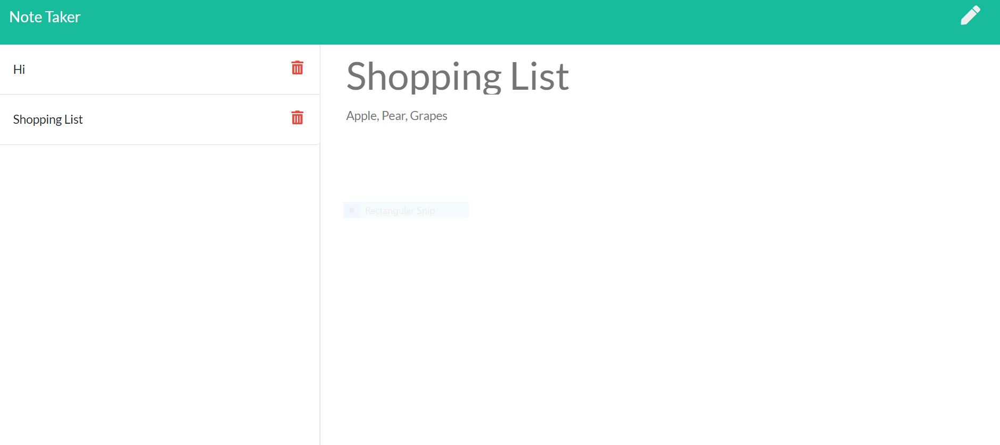

# Note Taker 

## Description
The goal for this project is to create an application called Note Taker that can be used to write and save notes. This application will use an Express.js back end and will save and retrieve note data from a JSON file.

## Installation

npm init

npm install inquirer

npm install express

#

## Link
https://pure-ocean-79554.herokuapp.com/